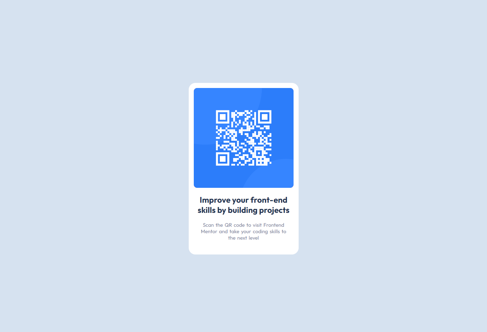

# Frontend Mentor - QR code component solution

This is a solution to the [QR code component challenge on Frontend Mentor](https://www.frontendmentor.io/challenges/qr-code-component-iux_sIO_H). Frontend Mentor challenges help you improve your coding skills by building realistic projects. 

## Table of contents

- [Overview](#overview)
  - [Screenshot](#screenshot)
  - [Links](#links)
- [My process](#my-process)
  - [Built with](#built-with)
  - [What I learned](#what-i-learned)
  - [Continued development](#continued-development)
  - [Useful resources](#useful-resources)
- [Author](#author)

## Overview

### Screenshot



### Links

- Solution URL: [Solution](https://github.com/JustANipple/QR-code-component/blob/main/index.html)
- Live Site URL: [Live site](https://justanipple.github.io/QR-code-component/)

## My process

### Built with

- Semantic HTML5 markup
- CSS custom properties
- Flexbox
- Media query

### What I learned

I learned to use view width and view height to set the width of the entire QR box. This makes the site responsive for desktop or mobile device

To see how you can add code snippets, see below:

```css
    @media screen and (max-width: 375px) {
        .container {
          width: 87vw;
        }
    }
```

### Continued development

I'm struggled a lot on aligning the starting words of H2 and paragraphs. I couldn't figure out if it was an align problem or just a spacing problem.
I tried to place them in the same div, so they had the same start, but aligning them to the center made it all useless

I'm aiming to improve positioning

### Useful resources

- [Relative units](https://developer.mozilla.org/en-US/docs/Learn/CSS/Building_blocks/Values_and_units) - This helped me with the relative units to make the site responsive

## Author

- Frontend Mentor - [@JustANipple](https://www.frontendmentor.io/profile/JustANipple)
